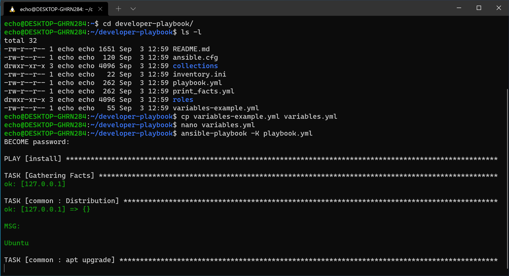
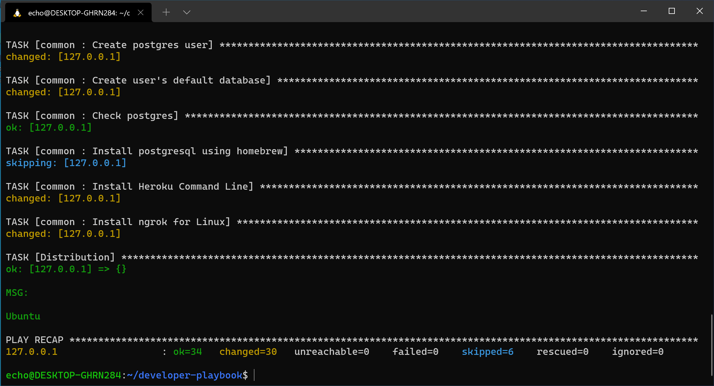
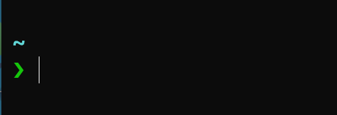

# Ansible Playbook

> Note: the screenshots in this section might look different between macOS and Windows with WSL, but the commands are the same.

An ansible playbook is a set of instructions for setting up a computer system.

We will be using ansible-pull to pull down the playbook and excute it on our computer.

## Installing ansible collections

The playbook depends on a few ansible collections to do it's magic. So we need to
install those first.

Run the following command to install the collections.

```shell
ansible-galaxy collection install community.postgresql community.general
```

## Running the playbook

Now we can run the following command to run the ansible playbook.

```sh
ansible-pull -K -U https://github.com/bartdorsey/developer-playbook.git playbook.yml
```

The first thing the playbook does is ask you for a `BECOMES` password.  This is
because ansible needs to `BECOME` the superuser in order to install some of the
software. Just type your macOS or Linux password here and press enter.

Then ansible attempts to install all the software.

Sit back and relax, this could take a while.






Once this is complete it should look something like this: (It might vary slightly between macOS and Windows)

## Restart your terminal

The last step is to close your terminal and reopen it, Once you've reopened it,
you should notice your prompt looks different. This is the [starship] prompt `>`,
and it can show you more information than just the folder you are in. (things like the node version of your project and information about your git branch.. Just trust us, this will be useful later.)



> Note: Ubuntu Desktop Linux users, it will be necessary to actually log out of the Ubuntu desktop
> and back in to make everything work correctly.

## Congratulations

You've now got all the software installed you need to be a real web developer!

Once you've got this completed you can move on an read about [extra resources]

[Visual Studio Code]:https://code.visualstudio.com/
[extra resources]:extra-resources.md
[starship]:https://starship.rs
