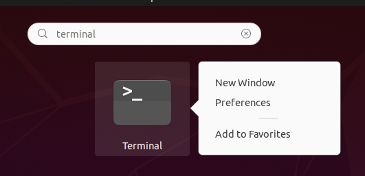
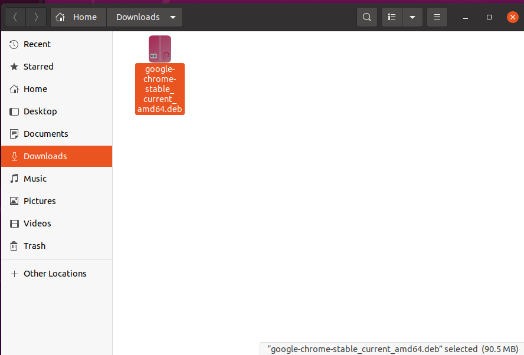
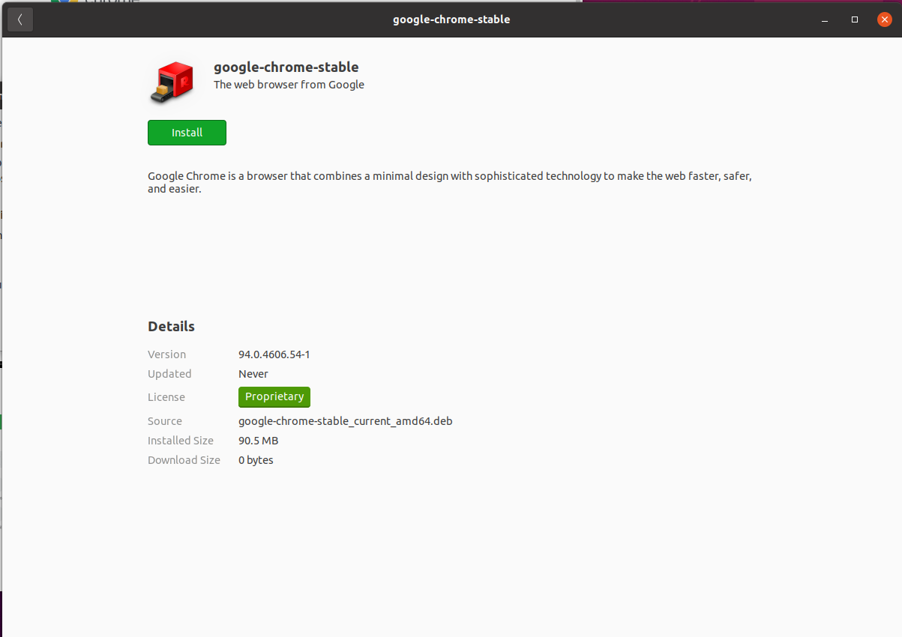
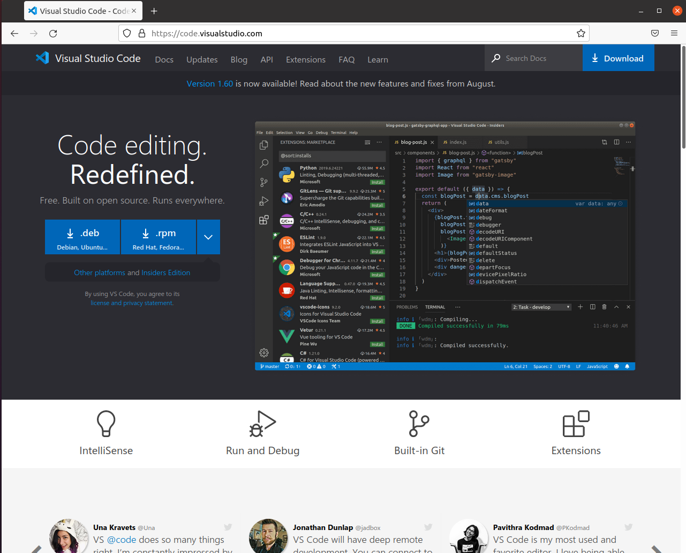

# Ubuntu Developer Setup Guide

This guide supports Ubuntu version 20.04 LTS. Some of these steps might be identical in other Ubuntu versions, but it is highly recommended you have this version. See your instructor if you have a different version.

## The Ubuntu Terminal

We will be using a command line interface for a lot of our development tasks.

So it's a good idea to launch the Ubuntu Terminal and pin it to your favorites in your dock for easy access.

Start by clicking the application menu in the bottom left corner of the screen and typing "Terminal" in the search box.


You can right click on the terminal icon and choose `Add to Favorites` and it will put it in your ubuntu dock.



## Google Chrome

Ubuntu comes with Firefox, which is a fine web browser, but as a working web
developer, you'll need to test your sites in multiple web browsers.  So we'll
install the popular web browser Google Chrome.

Open Firefox and visit the [Chrome Website]

Click download Chrome and make sure the 64 bit .deb (For Debian/Ubuntu) option
is selected.  Then click **Accept and Install**.

The following dialog box will appear:

Click Save File, then Ok and the file will be downloaded to your Downloads folder.

Open the Downloads folder using the Ubuntu file manager and double click the `google-chrome-stable_current_amd64.deb` file in there.



This will bring up the Ubuntu installer window, from there, you can click Install, enter your password when prompted and finish the installation.



Once this has finished you can close this window, head back to the application menu and add Chrome to your Favorites as well.

## Visual Studio Code

Visual Studio Code (VSCode) is the Code editor we will be using.

Installing it is similar to how we installed Chrome above:

Just visit the [VSCode Website]

And download the .deb for Debian/Ubuntu option.



Save it to your Downloads folder and double click on it to install it.

Then add it to your favorites as well.

## Insomnia

Next up is a tool we'll be using to debug our APIs (Application Programming Interface)

Visit the [Insomnia Website] and download and install Insomnia and add it to your favorites.

## Postbird

Next up, is Postbird, a Graphical User Interface (GUI) for the PostgreSQL
database.

Head to the [postbird website on github], scroll down and you should
see a series of links, you'll want the one that ends in `amd64.deb`

Download it and install it and add it to your favorites.

## Git

Now we need to install a command line utility called `git`.

Open your Ubuntu Terminal and type

```shell
sudo apt update
```

and press enter. (you may be prompted for your password)

When that finishes type this command and hit enter.

```shell
sudo apt install git
```

## Next steps

Once you've installed this, move on to [Installing Ansible]

[Chrome Website]:https://www.google.com/chrome
[VSCode Website]:https://code.visualstudio.com
[Insomnia Website]:https://insomnia.rest/download
[postbird website on github]:https://github.com/Paxa/postbird
[Installing Ansible](ansible-setup.md)
