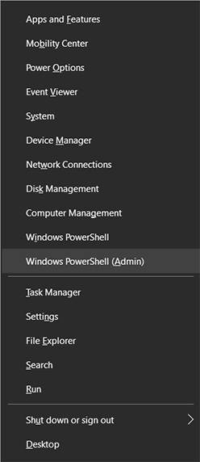
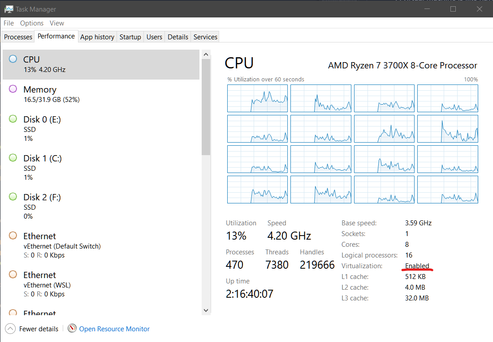
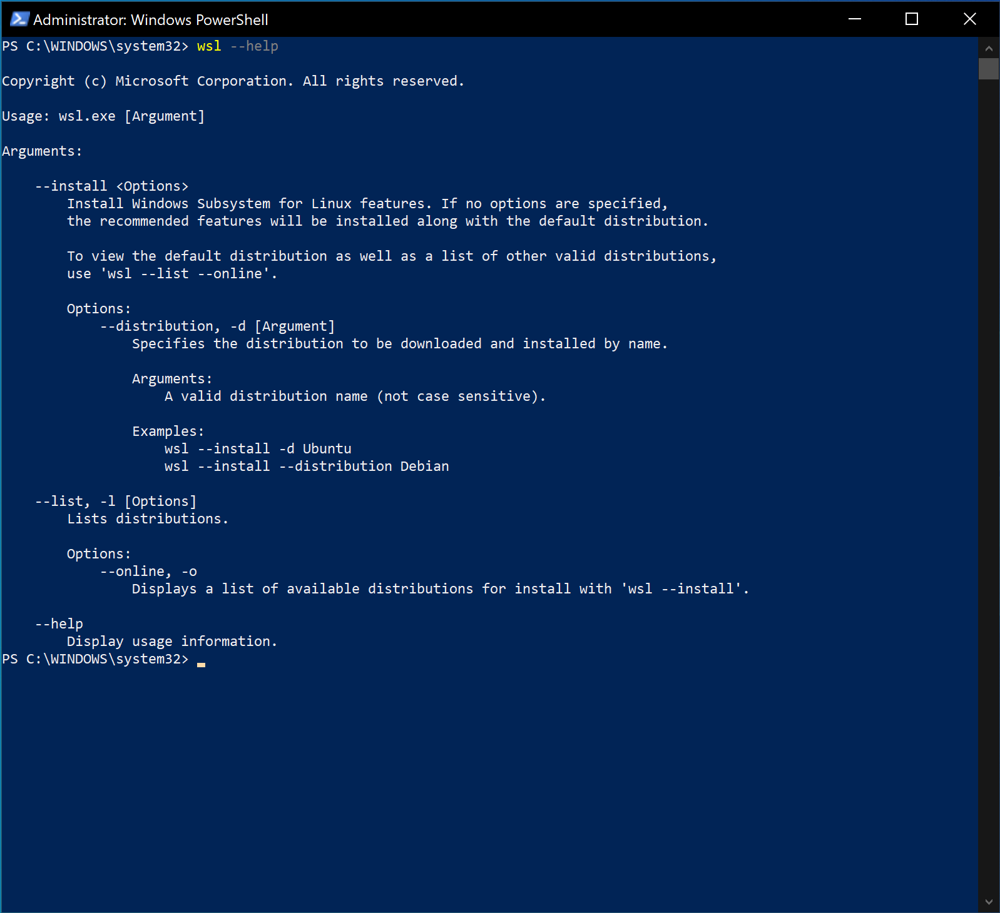

# Windows Developer Setup Guide

Most of the initial parts of this setup happen in Windows Powershell.

Windows Powershell is the command line interface for Windows.

so go ahead and right click on he start menu, and choose "Windows Powershell (Administrator)" from the options



## [Windows Subsystem for Linux] (WSL)

We aren't going to be doing Windows development though. What we need is a Unix
or Linux system. This is because most web servers run some form of Linux.

Luckily Microsoft provides a piece of software called "[Windows Subsystem for Linux]" (WSL).

This can run Linux [Virtual Machines] on your computer.

A virtual machine is like having a computer within your computer.  Like in the movie
*[Inception]*, but for operating systems.

This virtual computer has it's own memory and hard drive space allocated to it.

WSL lets you create different versions of Linux, but we are going to use [Ubuntu] Linux.

## Checking your hardware for the ability to run WSL

In order to run WSL, you **must** have a computer cable of doing [Hardware Virtualization].

Unfortunately many cheaper PCs don't have this ability, and many PCs have it, but have it disabled by default.

You can check if you have virtualization enabled by running Windows Task Manager and looking for "Virtualization: Enabled"



If you don't see this, check with your computer manufacturer to see if it's available to be turned on on your model of computer.

Often you can enable this in the setup screen of your computer (Often called the BIOS). Sometimes a prompt appears when you first turn on your computer telling which key to hit (often F2 or Del) to enter the BIOS Setup.  Once in the Setup screen look for something related to Virtualization and make sure it's enabled.

- Intel Processors often call this feature VT-X.
- AMD Processors often call this feature SVM or AMD-V.

This varies from manufacturer to manufacturer so unfortunately we cannot give you exact instructions on how to enable it.

## Checking for WSL

First, let's see if you have the wsl command already available on your system.

Type the following into the Powershell prompt:

```powershell
wsl --help
```

You should see the following:



**IMPORTANT**: If you don't see this, or get an error, you may need to update Windows 10 to the
latest version.  Head to the Windows Update section of the Settings app and
update to the latest version of Windows 10.

> Note: If for whatever reason you can't upgrade Windows to a version that includes
> the wsl command, you can try to use Microsoft's [Manual Install instructions].

Once you've checked this stuff, it's time to move on to [Installing WSL and Ubuntu Linux]

[Installing WSL and Ubuntu Linux]:wsl-ubuntu-setup.md
[Windows Subsystem for Linux]:https://docs.microsoft.com/en-us/windows/wsl/about
[Virtual Machines]:https://en.wikipedia.org/wiki/Virtual_machine
[Inception]:https://www.imdb.com/title/tt1375666/
[Hardware Virtualization]:https://en.wikipedia.org/wiki/Hardware_virtualization
[Ubuntu]:https://ubuntu.com
[Manual Install Instructions]:https://docs.microsoft.com/en-us/windows/wsl/install-win10#manual-installation-steps
