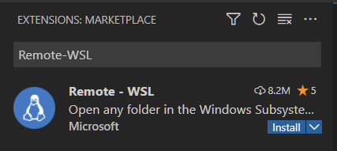

# Installing Windows Applications

In a moment, we will be using Ansible to setup our WSL environment, however Ansible on WSL can't install Windows apps, so you'll need to install the following apps manually.

- [Visual Studio Code] - This is the main code editor we'll be using.
- [Insomnia] - A tool to test APIs. Just download the free version.
- [Postbird] - A tool for browsing your PostgreSQL database

## Web Browsers

As a web developer, you will often need to test your website in multiple browsers,
so here's the big list of all the common ones we usually worry about.

- [Google Chrome] - While you can use any web browser, we will often being using
  the Chrome developer tools built into Google Chrome.
- [Firefox] - Firefox is a popular open source Browser, and includes developer tools as well
- [Edge] - Much maligned, Microsoft Edge isn't the Internet Explorer of yesterday, it's now built with Chromium, the same base as Google Chrome. It's also available on macOS now.
- [Safari] - If you have a mac, you already have this. If you are on Windows, then you are out of luck.

## Visual Studio Code Extension

You will need to launch VSCode and install an extension to get it to work correctly
with WSL.

The extension is called *Remote - WSL*.  You can navigate to the Extensions panel
using the button on the panel on the left of VSCode.

Then search for "Remote-WSL", find it in the list and click install.

Once you've got everything installed, move on to [Installing Ansible]

[visual studio code]: https://code.visualstudio.com/
[insomnia]: https://insomnia.rest/pricing
[postbird]: https://github.com/Paxa/postbird/releases/download/0.8.4/Postbird-Setup-0.8.4.exe
[google chrome]: https://google.com/chrome
[firefox]: https://firefox.com
[edge]: https://www.microsoft.com/en-us/edge
[safari]: https://www.apple.com/safari/

[Installing Ansible]:../ubuntu/ansible-setup.md
