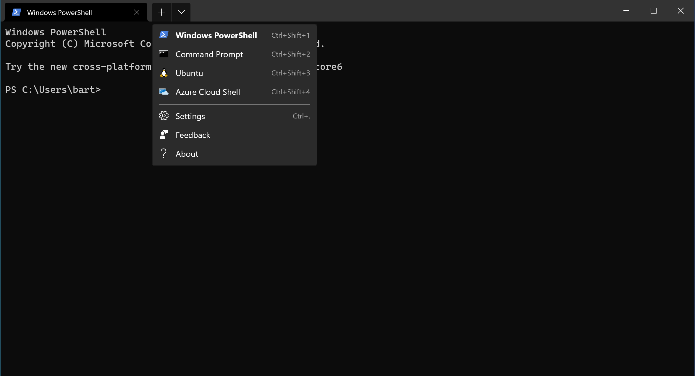
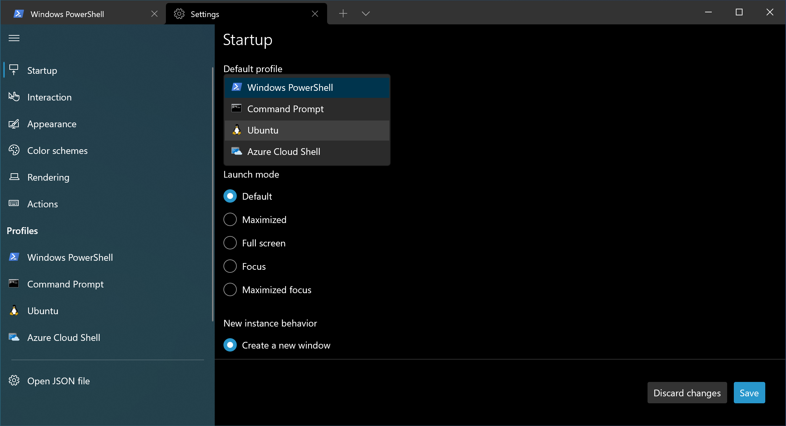
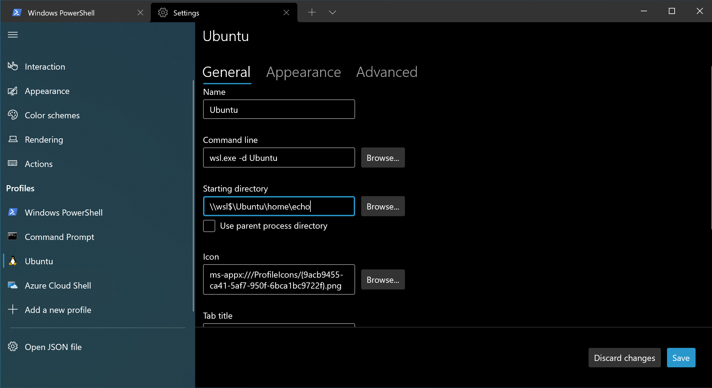
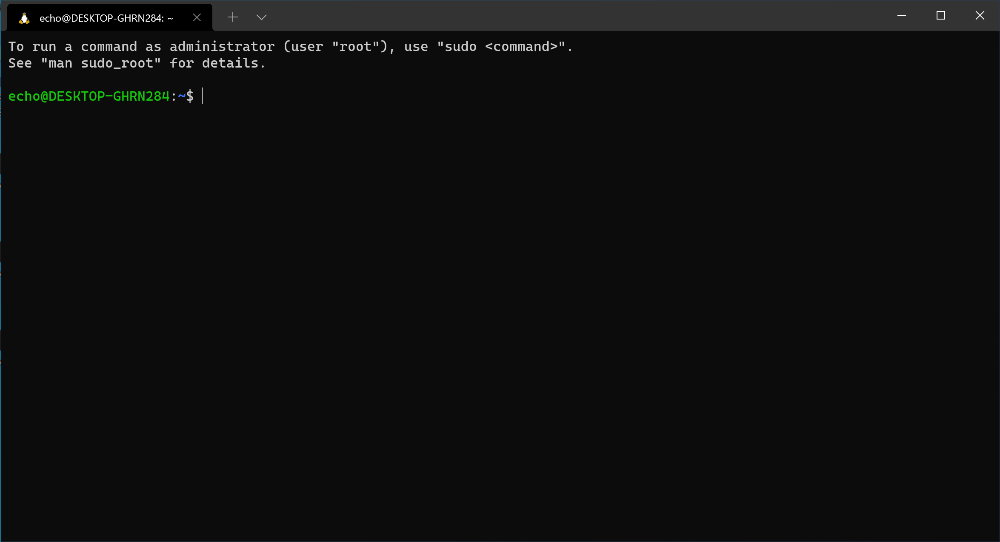

# Install Windows Terminal

While WSL includes an Ubuntu terminal, it is not very user friendly when it comes to copy and pasting stuff into the terminal.  Luckily for us Microsoft has a new Windows Terminal app that is much nicer to use. It also supports both Powershell and WSL.

You can simply download and install [Windows Terminal] from the Microsoft Store.

Then search for it in your Windows start menu, and pin it to your task bar, we
will be using it a lot.

When you first open it, it will open Powershell. But we can change the settings
to open Ubuntu by default. Click on the down arrow beside the tabs to get to the
Settings.



In the Startup section change the default profile to Ubuntu and hit Save.



Then head to the list of profiles on the left, and select the Ubuntu profile.

## Changing the Ubuntu starting directory



By default WSL, starts us up in our *Windows Home Folder*. However microsoft recommends we *DO NOT* keep our files inside our Windows Home Folder, but instead
inside our Linux home folder.  So we can change the Starting directory to the following, replacing **`username`** with the username you created for your Ubuntu system.

```text
\\wsl$\Ubuntu\home\username
```

Then hit save.

Let's test it! Close Windows Terminal and open it back up.

It should now open and look like this (except your username and computer name may be different in your prompt).

But you should see the `~` (tilde) in your prompt showing you are currently in your linux home directory.



## [Unix Terminology]

You may want to read about certain [Unix Terminology] that you will need to be familar with as a developer before continuing.

Once you've read that, move on to [Installing Ansible]

[Installing Ansible]:ansible-setup.md
[Unix Terminology]:resources/unix-terminology.md
[Windows Terminal]:https://www.microsoft.com/en-us/p/windows-terminal/9n0dx20hk701
