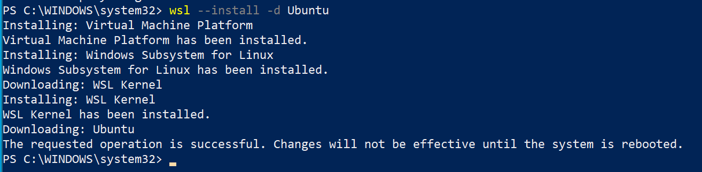
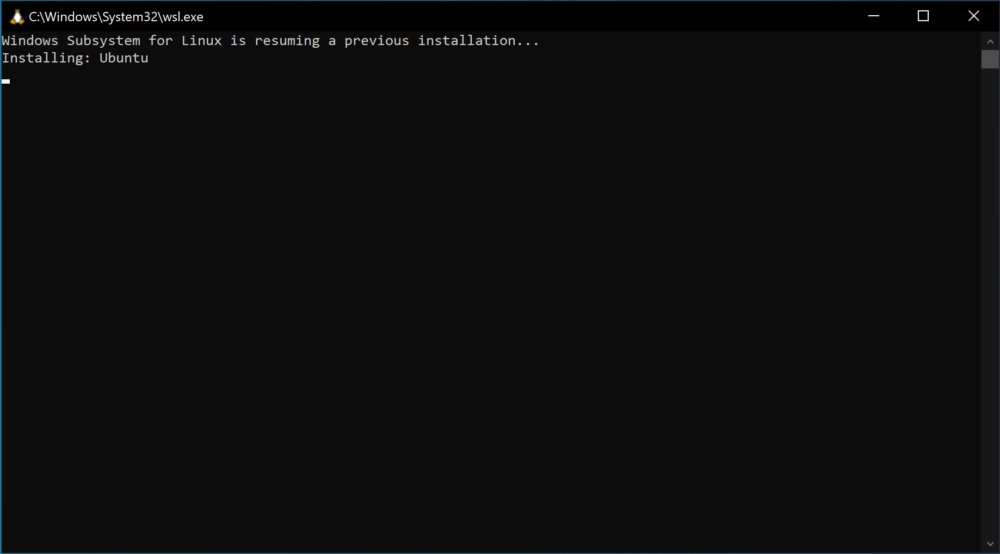
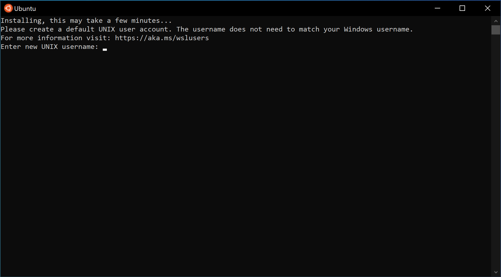
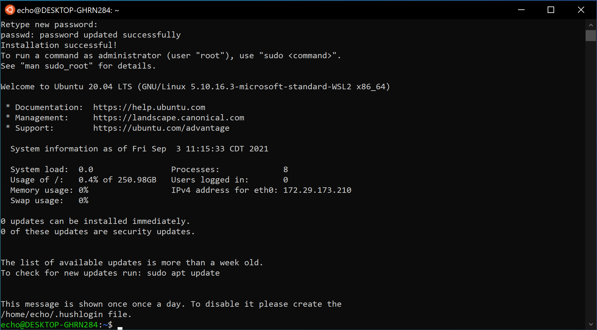

# Install WSL and Ubuntu

Now it's time to install WSL and Ubuntu.

Type the following into the powershell prompt exactly and hit enter:

```powershell
wsl --install -d Ubuntu
```

This will download and install WSL, the WSL Linux Kernel and Ubuntu.



Once it finishes, close Powershell and **restart** your computer.

After a reboot, the setup of Ubuntu will continue, you will see powershell reopen.



and then an "Ubuntu" window opens and installs Ubuntu (this step might take a while)

It will prompt you for your username.  You can make this whatever you would like.

Remember this is a new *virtual computer*, it has it's own username and it's own password. So don't forget it!



Once Ubuntu is finished, you should see the Ubuntu terminal prompt.



Once you've got the Ubuntu Terminal prompt, Move on to [Installing Windows Terminal]

[Installing Windows Terminal]:windows-terminal-setup.md
